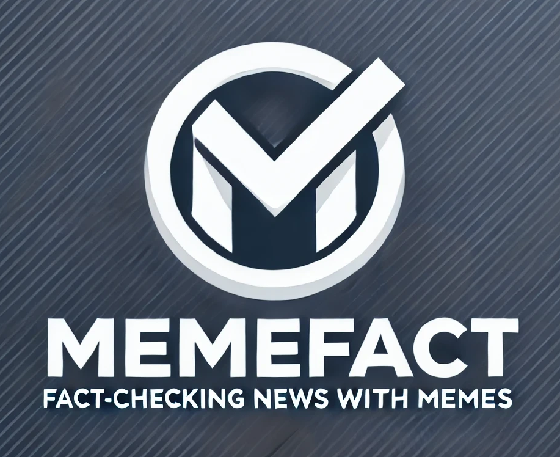

<div align="center">
    
    <h1>MemeFact</h1>
</div>

<div align="center">
    <p><strong>Grade of Thesis Proposal:</strong> 19/20</p>
    <p><strong>Grade of Final Dissertation:</strong> 19/20</p>
    <p><em>The full dissertation and extended abstract will be linked here once published by Instituto Superior Técnico, Universidade de Lisboa</em></p>
</div>

## 📝 Publications

- **ECAI 2024 MAI-XAI Workshop (Published)**: Altoe, F., Burel, G., Pinto, S.M.G., Alani, H., Pinto, H.S. (2024). "Towards AI-mediated Meme Generation for Misinformation Correction Explanation". [View PDF](https://ceur-ws.org/Vol-3803/paper5.pdf)

- **IJCAI Human-Centred AI Track (Accepted)**: Altoe, F., Pinto, S.M.G., Pinto, H.S. (2025). "Explainable Automatic Fact-Checking for Journalists Augmentation in the Wild" [Conference Homepage](https://2025.ijcai.org/call-for-papers-human-centred-artificial-intelligence/)

## 🌟 Key Findings

Our research revealed several important insights about meme-based fact-checking and AI evaluation:

### Meme Generation & Effectiveness
- Established that AI (Claude-3.5-Sonnet) can generate memes that surpass human quality on structural metrics (clarity, coherence, persuasiveness)
- Identified Claude-3.5-Sonnet as the overall best-performing model for this task, with Qwen-2 being the most cost-effective open-source alternative
- Demonstrated that meme-based explanations significantly reduced backfire effects and resulted in more effective belief correction compared to text summaries
- Showed that contextual information is critical for the perceived credibility of meme-based explanations
- Observed that 7.56% of targeted users deleted their misinformation posts following meme-based corrections, with deletion correlating significantly with the correction meme's engagement

### AI Evaluation Insights
- Confirmed the presence of self-evaluation bias in several SOTA LLMs (Gemini 1.5 Pro, GPT-4o, Claude-3.5-Sonnet), which rated their own generated memes significantly higher than those generated by other models
- Quantified LLM overconfidence in meme evaluation using GPT-4o, revealing a significant gap between its self-reported confidence and lower true confidence derived from token probabilities
- Uncovered a potential systematic bias in LLM evaluation, observing that Gemini 1.5 Pro and Claude-3.5-Sonnet reported higher confidence when assessing memes debunking pro-Republican claims
- Suggested that AI models exhibit stronger agreement with each other than humans do when evaluating memes
- Determined that evidence for LLMs acting as reliable proxies for human judgment in meme evaluation is inconclusive, with results indicating weak alignment with human ratings and a systematic tendency to rate memes more positively than human evaluators

### Social & Demographic Factors
- Found evidence for echo chamber reinforcement mechanisms, where higher engagement intentions correlated with both increased confidence and increased belief in misinformation
- Identified political orientation as the strongest demographic predictor of news veracity discernment, with higher scores for liberal participants linked primarily to better rejection of fake news compared to conservative participants

## 🖼️ Example Output

Below is an example meme generated by MemeFact using Claude-3.5-Sonnet (temperature=1.0) with the RAG variant, responding to the claim:

### "We have cut the flow of fentanyl by half."


*Fact-check source: [PolitiFact - Fentanyl seizures have doubled, has the flow of fentanyl been cut in half?](https://www.politifact.com/factchecks/2024/oct/11/kamala-harris/fentanyl-seizures-have-doubled-has-the-flow-of-fen/)*

## 📋 Table of Contents

- [About](#about)
- [Features](#features)
- [Datasets](#datasets)
- [Project Structure](#project-structure)
- [Installation](#installation)
- [Usage](#usage)
- [Configuration](#configuration)
- [Social Media](#social-media)
- [Study Materials](#study-materials)
- [How to Cite](#how_to_cite)
- [Additional Information](#additional_information)
- [Acknowledgements](#acknowledgements)
- [License](#license)

## 🔍 About <a name="about"></a>

MemeFact is a Retrieval Augmented Generation system for creating fact-checking memes that explain verdict rationales in an engaging visual format. Developed as part of a Master's thesis, this system leverages Large Language Models to generate memes that provide more effective belief correction compared to traditional text-based fact-checking.

## ✨ Features <a name="features"></a>

- **Multiple Model Support**: Works with both proprietary models (GPT-4o, Gemini-1.5-Pro, Claude-3.5-Sonnet) and open-source alternatives (Pixtral-Large-2411, Llama-3.2-90b-Vision-Instruct, Qwen-2-VL-72b-Instruct)
- **Architecture Variants**:
  - `baseline`: Direct prompting approach
  - `rag`: Retrieval Augmented Generation for context-enhanced meme creation
  - `debate`: Multi-model collaborative approach to caption generation
- **Fact-Checking Sources**: Compatible with multiple fact-checking organizations including PolitiFact, FullFact, and FactCheck.org
- **Content Safety**: Integrated content moderation to prevent harmful outputs
- **Customizability**: Control model parameters including temperature, max tokens, top_p, and top_k

> **Best Configuration**: Our research found that Claude-3.5-Sonnet with temperature=1.0 using the RAG variant produced the highest quality fact-checking memes.

## 📊 Datasets <a name="datasets"></a>

This project has produced three datasets, all available on Hugging Face:

1. [**MemeFact Templates**](https://huggingface.co/datasets/sergiogpinto/memefact-templates): 663 meme templates augmented with contextual knowledge
2. [**MemeFact LLM Evaluations**](https://huggingface.co/datasets/sergiogpinto/memefact-llm-evaluations): 7,680 meme evaluations from the LLM Judge Study
3. [**FactCheck Memes X**](https://huggingface.co/datasets/sergiogpinto/factcheck-memes-x): 119 meme correction posts and engagement metrics from social media deployment

## 📁 Project Structure <a name="project-structure"></a>

```
memefact/
├── config/                    # Configuration files and prompts
├── data/
│   ├── imkg/process/          # Processed data from IMKG
│   └── raw/meme_image/        # Raw meme templates
├── llm_judge/                 # LLM Judge study materials
│   ├── notebooks/             # Analysis notebooks
│   ├── plots/                 # Generated figures
│   ├── memes/                 # Evaluated memes
│   └── code/                  # Evaluation scripts
├── llm_selection/             # LLM Selection study materials
│   ├── notebooks/             # Analysis notebooks
│   ├── plots/                 # Generated figures 
│   ├── memes/                 # Generated candidate memes
│   ├── claims/                # Fact-checking claims and sources
│   └── code/                  # Study code
├── meta_study/                # Meta study comparing explanation modalities
│   ├── notebooks/             # Analysis notebooks
│   ├── plots/                 # Generated figures
│   ├── memes/                 # Memes used in the study
│   └── claims/                # Claims and their sources
├── src/                       # Core MemeFact system code
└── x_bot_study/               # Social media deployment study
    └── notebooks/             # Analysis notebooks
```

## 🛠️ Installation <a name="installation"></a>

MemeFact is built with Python 3.12 and uses Poetry for dependency management.

1. Clone the repository:
```bash
git clone https://github.com/sergiomgpinto/MemeFact.git
cd MemeFact
```

2. Install dependencies:
```bash
poetry install
```

3. Set up environment variables for API access:
```bash
cp .env.example .env
# Edit .env with your API keys
```

## 🚀 Usage <a name="usage"></a>

### Basic Usage

To generate a meme for a fact-checking article:

```bash
poetry run python src/run_meme_fact.py --variant rag \
    --config config.yaml \
    --article https://www.politifact.com/factchecks/2021/jul/15/facebook-posts/yes-excess-carbon-dioxide-atmosphere-problem-earth/ \
    --model claude-3.5-sonnet
```

> **Note:** On first run, the system will create a vector database which takes approximately 11 minutes. You'll see a message like:
> ```
> INFO:rag.vector_db:Vector database meme_fact_vector_db not found. Creating new collection.
> ```

The system deliberately includes detailed console output for the generated captions to help users understand the system's reasoning process.

### Available Models

You can specify any of the following models with the `--model` flag:

- Proprietary models: `gpt-4o`, `gemini-1.5-pro`, `claude-3.5-sonnet`
- Open-source models: `pixtral-large-2411`, `llama-3.2-90b-vision-instruct`, `qwen-2-vl-72b-instruct`

### Architecture Variants

Choose between different system variants with the `--variant` flag:

```bash
# Baseline approach
poetry run python src/run_meme_fact.py --variant baseline --config config.yaml --article URL --model MODEL

# RAG approach (recommended)
poetry run python src/run_meme_fact.py --variant rag --config config.yaml --article URL --model MODEL

# Debate approach
poetry run python src/run_meme_fact.py --variant debate --config config.yaml --article URL --model MODEL
```

### Supported Fact-Checking Sources

MemeFact currently supports articles from:
- PolitiFact (https://www.politifact.com/)
- FullFact (https://fullfact.org/)
- FactCheck.org (https://www.factcheck.org/)

The system automatically extracts the content of the articles.

## ⚙️ Configuration <a name="configuration"></a>

The `config.yaml` file allows customization of various parameters:

```yaml
model_params:
  temperature: 1.0  # Controls randomness (0.0-1.0)
  max_tokens: 1024  # Maximum output length
  top_p: 0.9        # Nucleus sampling parameter
  top_k: 40         # Top-k sampling parameter
  
prompt_type: few-shot  # Options: zero-shot, few-shot, cot, cov, clot
```

The `prompt_type` parameter selects which prompting technique to use, determining how the system interacts with the language model.

## 🔗 Social Media <a name="social-media"></a>

MemeFact was deployed on X (formerly Twitter) for real-world testing:
- Account: [@Meme__Fact](https://x.com/Meme__Fact)

## 📑 Study Materials <a name="study-materials"></a>

The Google Forms surveys and Prolific announcements used in the LLM Selection Study and Meta Study can be downloaded from:
[https://drive.tecnico.ulisboa.pt/download/1695927966965160](https://drive.tecnico.ulisboa.pt/download/1695927966965160)

## 📚 How to Cite <a name="how_to_cite"></a>

If you use MemeFact in your research, please cite our work:

```bibtex
@mastersthesis{pinto2025factchecking,
  title={Fact-Checking News with Internet Memes},
  author={Pinto, Sergio Miguel Goncalves},
  school={Instituto Superior Tecnico, Universidade de Lisboa},
  year={2025},
  month={June}
}
```

## ℹ️ Additional Information <a name="additional_information"></a>

- **Web Interface**: There is no web interface or demo available for MemeFact beyond the X bot account [@Meme__Fact](https://x.com/Meme__Fact).

- **Future Development**: This repository represents a completed academic project with no planned future development.

- **Contact**: For questions or inquiries about this research, please contact: sergio.g.pinto@tecnico.ulisboa.pt

## 🙏 Acknowledgements <a name="acknowledgements"></a>

This work builds upon several important resources:

- **Internet Memes Knowledge Graph (IMKG)**: Our meme templates and contextual information were derived from IMKG, a comprehensive structured resource for internet meme research. [IMKG paper](https://2023.eswc-conferences.org/wp-content/uploads/2023/05/paper_Tommasini_2023_The.pdf)

- **FactFlip**: We acknowledge Grégoire Burel's [FactFlip repository](https://github.com/evhart/factflip), which provided code for parsing IMKG.

- **CIMPLE Project**: This research was developed under the Countering Creative Information Manipulation with Explainable Artificial Intelligence (CIMPLE) project, approved under the 2019 CHIST-ERA call "Explainable Machine Learning-based Artificial Intelligence."

## 📜 License <a name="license"></a>

This project is licensed under the **Creative Commons Attribution-NonCommercial 4.0 International License (CC BY-NC 4.0)**.

[![CC BY-NC 4.0][cc-by-nc-shield]][cc-by-nc]

For the full license text, see the [LICENSE](LICENSE) file in this repository.

[cc-by-nc]: http://creativecommons.org/licenses/by-nc/4.0/
[cc-by-nc-shield]: https://img.shields.io/badge/License-CC%20BY--NC%204.0-lightgrey.svg

---

<div align="center">
    <p>Developed as a Master's thesis at Instituto Superior Técnico, Universidade de Lisboa</p>
</div>